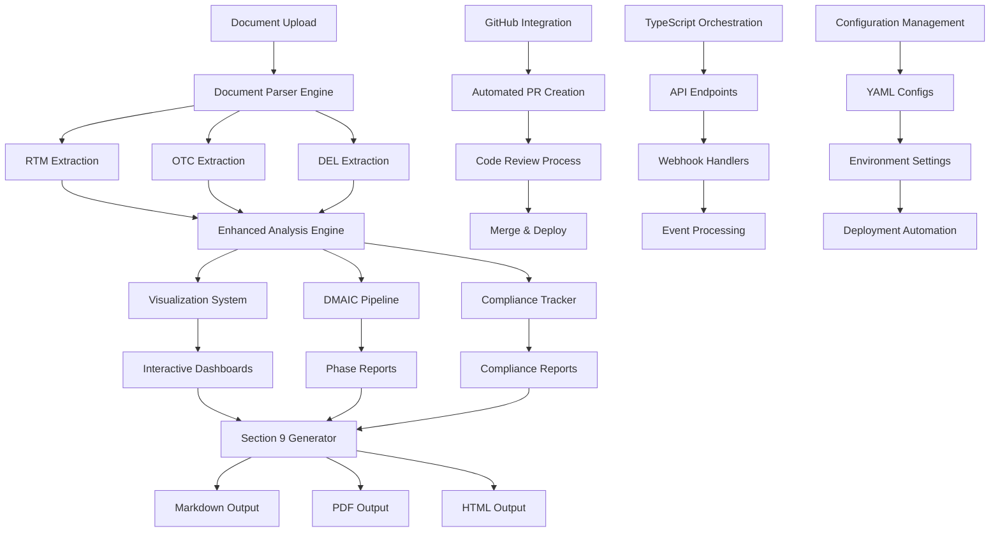
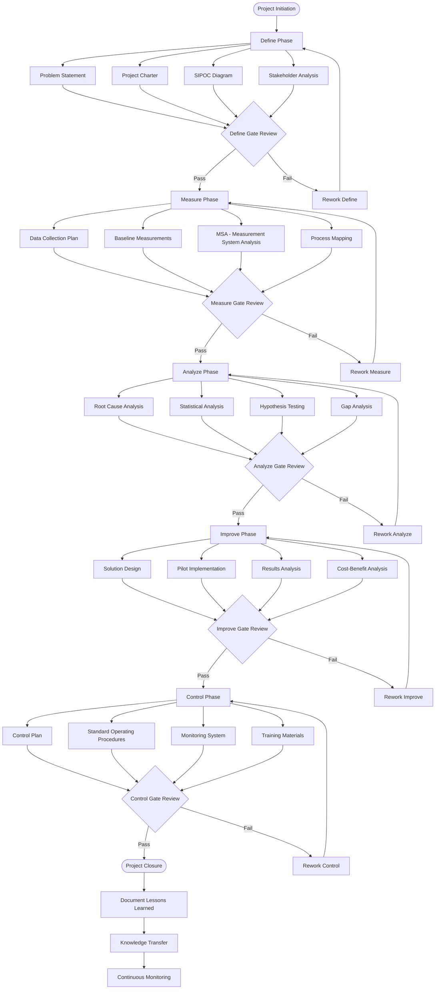
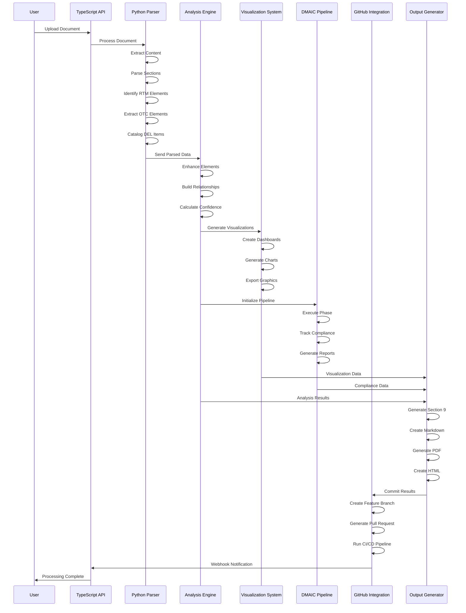
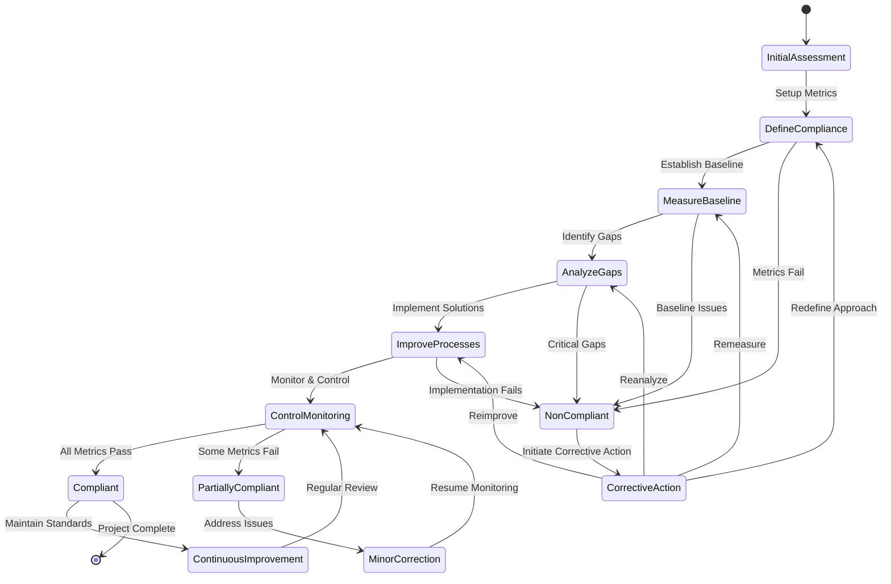
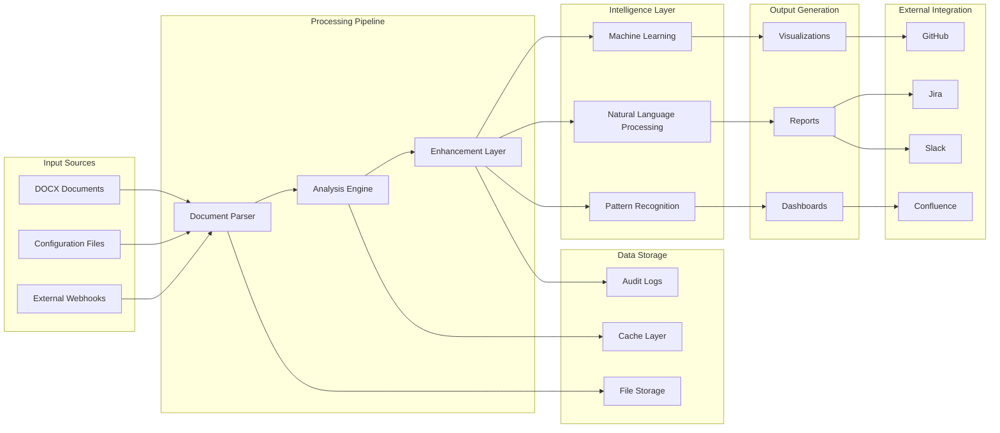

# Workflow Visualization with Mermaid Diagrams

## System Architecture Overview



## DMAIC Process Flow



## Document Processing Pipeline



## Compliance Tracking Workflow



## GitHub Integration Workflow

```mermaid
gitgraph
    commit id: "Initial Setup"
    branch feature/enhanced-automation
    checkout feature/enhanced-automation
    commit id: "Add Parser Engine"
    commit id: "Add Visualization System"
    commit id: "Add DMAIC Pipeline"
    commit id: "Add TypeScript Orchestration"
    commit id: "Add Configuration Management"
    commit id: "Add Section 9 Generator"
    commit id: "Add Workflow Diagrams"
    
    checkout main
    merge feature/enhanced-automation
    commit id: "Release v2.0.0"
    
    branch hotfix/compliance-update
    checkout hotfix/compliance-update
    commit id: "Fix Compliance Metrics"
    
    checkout main
    merge hotfix/compliance-update
    commit id: "Hotfix v2.0.1"
    
    branch feature/advanced-analytics
    checkout feature/advanced-analytics
    commit id: "Add ML Analytics"
    commit id: "Add Predictive Models"
    
    checkout main
    merge feature/advanced-analytics
    commit id: "Release v2.1.0"
```

## System Component Interaction

```mermaid
C4Component
    title Component Diagram - Enhanced Document Management System
    
    Container_Boundary(api, "API Layer") {
        Component(orchestration, "TypeScript Orchestration Server", "Node.js/Express", "Handles API requests, webhooks, and real-time communication")
        Component(auth, "Authentication Service", "JWT", "Manages user authentication and authorization")
        Component(websocket, "WebSocket Handler", "Socket.IO", "Provides real-time updates and notifications")
    }
    
    Container_Boundary(processing, "Processing Layer") {
        Component(parser, "Document Parser Engine", "Python", "Extracts and parses RTM, OTC, DEL elements")
        Component(analyzer, "Analysis Engine", "Python", "Enhances elements with relationships and confidence scores")
        Component(dmaic, "DMAIC Pipeline", "Python", "Manages DMAIC phases and compliance tracking")
    }
    
    Container_Boundary(visualization, "Visualization Layer") {
        Component(viz_engine, "Visualization Engine", "Plotly/Python", "Generates interactive dashboards and charts")
        Component(section9, "Section 9 Generator", "Python/Jinja2", "Creates publication-ready reports")
        Component(dashboard, "Dashboard Service", "React/TypeScript", "Serves interactive web dashboards")
    }
    
    Container_Boundary(integration, "Integration Layer") {
        Component(github, "GitHub Integration", "GitHub API", "Manages repository operations and PR creation")
        Component(webhook, "Webhook Processor", "Node.js", "Processes external system webhooks")
        Component(notification, "Notification Service", "Multi-channel", "Sends alerts and updates")
    }
    
    Container_Boundary(storage, "Storage Layer") {
        Component(file_storage, "File Storage", "Local/Cloud", "Stores documents and generated artifacts")
        Component(config_mgmt, "Configuration Management", "YAML/JSON", "Manages system and workflow configurations")
        Component(cache, "Cache Layer", "Redis/Memory", "Caches frequently accessed data")
    }
    
    Rel(orchestration, parser, "Initiates processing")
    Rel(parser, analyzer, "Sends parsed data")
    Rel(analyzer, viz_engine, "Provides analysis results")
    Rel(analyzer, dmaic, "Triggers DMAIC phases")
    Rel(viz_engine, section9, "Supplies visualization data")
    Rel(orchestration, github, "Manages repository operations")
    Rel(webhook, orchestration, "Forwards webhook events")
    Rel(orchestration, websocket, "Broadcasts updates")
    Rel(all, file_storage, "Reads/writes files")
    Rel(all, config_mgmt, "Loads configuration")
```

## Data Flow Architecture



## Deployment Architecture

```mermaid
deployment
    node "Development Environment" {
        artifact "Source Code"
        artifact "Unit Tests"
        artifact "Local Configuration"
    }
    
    node "CI/CD Pipeline" {
        artifact "Build Process"
        artifact "Integration Tests"
        artifact "Quality Gates"
        artifact "Security Scans"
    }
    
    node "Staging Environment" {
        artifact "Staging Deployment"
        artifact "End-to-End Tests"
        artifact "Performance Tests"
        artifact "User Acceptance Tests"
    }
    
    node "Production Environment" {
        component "Load Balancer"
        component "API Gateway"
        
        node "Application Cluster" {
            component "Orchestration Service"
            component "Processing Service"
            component "Visualization Service"
        }
        
        node "Data Layer" {
            database "Document Storage"
            database "Configuration DB"
            database "Cache Layer"
        }
        
        node "Monitoring" {
            component "Logging Service"
            component "Metrics Collection"
            component "Alert Manager"
        }
    }
    
    node "External Services" {
        component "GitHub API"
        component "Notification Services"
        component "Backup Storage"
    }
```
